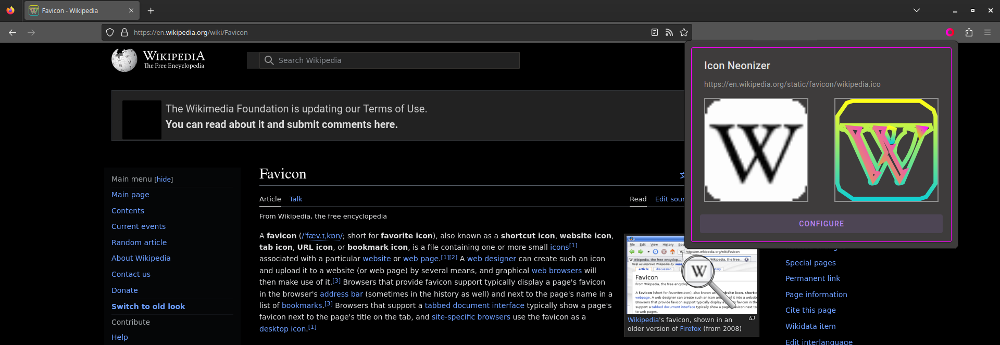

# Icon Neonizer - Firefox extension for brightly glowing favicons

Automatically replace favicons with a shiny bright version: 

When visiting a site for the first time, the favicon is extracted, traced, and re-drawn with new colors.

You can quickly compare the old an new icon through the extension's popup:

To tailor the icon, Icon Neonizer comes with a lavish interface that lets you configure the tracing process in detail:

Manually change colors, remove or add elements or replace the whole SVG through the included editor:

For each page, the generated icon is stored (for a limited time), so that icons are replaced consistently between visits. Browse your stored icons to see when they were last used, check size and to edit or remove them:

But you don't have to replace every icon, a blacklist is available to exclude sites or use a shared icon:

Colors, colors, colors! It's not for everybody, but if it is fun for you, it is a lot of fun!
